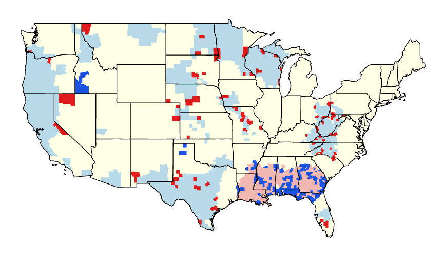

Analysis goals
--------------

1.  Do higher density and public transit use correspond to more
    coronavirus cases?
2.  What other variables might be correlated to COVID-19 cases?
3.  What further research would confirm variables correlation or
    causation?
4.  What urban planning policies might mitigate community transmission?

Step-by-step documentation
--------------------------

### Merging variables in R

First I forked [The New York Times Coronavirus
Github](https://github.com/nytimes/covid-19-data) and read in the case
data. Then I took the case data and cleaned the county names so they
would link across various datasets:

    # #read in csv
    case_data <- read_csv("~/GitHub/covid-19-data/us-counties.csv")
      
    # #clean up names, first select everything to be changed
    case_data_2 <- case_data %>% 
      filter(county != "Carson City" 
             & county != "St. Louis City" 
             & county != "Fairfax City" 
             & county != "Baltimore City"
             & county != "Kansas City"
             & county != "New York City"
             & county != "Franklin City"
             & county != "Richmond City"
             & county != "Roanoke City")

    # #create a small data frame to add back when cleanup is done
    case_data_3 <- case_data %>% 
      filter(county %in% c("Carson City", "St. Louis City", "Fairfax City", "Franklin City", "Baltimore City", "New York City", "Richmond City", "Roanoke City")) 

    # #make a list of words to remove
    wordstoremove <- c(" County", " City", " Parish", " and Borough", " Borough", " Municipality", " Census Area")%>% 
      paste0(collapse = "|")

    case_data_2 <- case_data_2 %>%
      mutate(county = str_remove_all(county, regex(str_c("\\b", wordstoremove, "\\b", collapse = "|"), ignore_case = T)),)

    # #merge together
    case_data <- rbind(case_data_2, case_data_3)

    # #make fips field numeric
    case_data$fips <- as.numeric(case_data$fips)

Capturing coronavirus cases at a single point in time would inaccurately
reflect rates of community spread because some counties would have had
it for several days or weeks before other counties. To standardize the
ratios, I filtered the cases so that each county’s ratios were isolated
2 weeks from the first recorded case of coronavirus. Then I wrote the
data to a spreadsheet to merge with the variables data.

    # #filter
    case_data <- case_data %>%
      filter(cases > 0) %>%
      group_by(date) %>%
      group_by(county, state) %>%
      slice(1L + 15)

    county_data <- case_data[complete.cases(case_data$fips), ]

    write_csv(county_data, "Data/case_data.csv")

I downloaded the census tables from [NHGIS](https://www.nhgis.org/), the
state regulations data from [Kaiser Family
Foundation](https://www.kff.org/health-costs/issue-brief/state-data-and-policy-actions-to-address-coronavirus/),
and the air quality data from the
[EPA](https://aqs.epa.gov/aqsweb/airdata/download_files.html). To
combine the datasets, I did an inner join on all tables using fips codes
or the county and state names:

    # #read in csvs
    county_pops <- read_csv("Data/county_population.csv")
    pop_density <- read_csv("Data/usa_pop_density.csv")
    aqi_data <- read_csv("Data/county_aqi_2019.csv")
    stay_home <- read_csv("Data/stay_at_home.csv")
    census_data <- read_csv("Data/census_tables.csv")
    case_data <- read_csv("Data/final_data.csv") %>% select(c(-county, -state))

    # #merge pop data
    pop <- left_join(county_pops, pop_density, by = c("county", "state"))

    # #merge population density to aqi data
    pop_aqi <- left_join(pop, aqi_data, by = c("county", "state"))

    # #merge pop_aqi data to stay at home orders
    pop_aqi_orders <- left_join(pop_aqi, stay_home, by = "state")

    # #merge pop_aqi_orders data to census data
    pop_aqi_orders_census <- left_join(pop_aqi_orders, census_data, by = c("county", "state"))

    # #merge pop_aqi_orders_census to case data
    final_data <- left_join(pop_aqi_orders_census, case_data, by = "fips")

Then I calculated the case and death ratios by dividing the number of
cases and deaths by the population and then multiplying by 100. Then I
saved the data in a clean schema:

    final_data$case_ratio <- final_data$cases / final_data$population * 100
    final_data$deaths_ratio <- final_data$deaths / final_data$population * 100

    final_data <- final_data %>% select(state, county, fips, population, pop_density, date, cases, case_ratio, deaths, deaths_ratio, everything())

    write_csv(final_data, "Data/final_data.csv")

After this, I pulled in the final dataset to ArcGIS Pro and did an add
join on the fips codes to a copied feature layer of the Esri [USA
Counties
(Generalized)](https://georgetownuniv.maps.arcgis.com/home/item.html?id=7566e0221e5646f99ea249a197116605)
layer on Living Atlas.

Now the data has a geometry field and I can do analysis.

### Hot Spot Analysis

First, I wanted to determine which areas are experiencing the worst
effects of coronavirus, so I ran the Optimized Hot Spot Analysis
geoprocessing tool in ArcGIS Pro on the case ratios.

The hot spot analysis geoprocessing tool creates a map of statistically
significant hot and cold spots using the Getis-Ord Gi\* statistic. This
is better than visualizing the distribution and density of the
phenomenon, because the statistic compares the underlying data against
neighboring data to identify which counties are statistically hotter or
colder.

### Outlier Analysis

To determine which counties might have a statistically significant
difference in their case numbers, I ran an outlier analysis. This
geoprocessing tool identifies statistically significant hot spots, cold
spots, and spatial outliers using the Anselin Local Moran’s I statistic.
This shows not only the hot and cold spots, but which counties within
those hot and cold spots are outliers.

### Random Forest Regression

To illuminate which factors and variables drive the biggest differences
in community spread of coronavirus, I turned to Random Forest
Regression, a supervised learning technique which combines the results
of multiple decision trees and then aggregates them, making it more
powerful than any single decision tree, which tend to overfit the data.
Random Forest Regressions attempt to predict the value of a single
variable (in this example, the case ratio) based on the values of other
variables selected.

#### Data requirements

Based on various reports about the potential transmission factors, I
isolated the following variables for analysis:

| CRITERIA                          | DEFINED AS                                        | SPATIAL FEATURES  | ATTRIBUTE INFORMATION                                                                                   | DATASET                                   | PREPARATION                                                                                                 |
|:----------------------------------|:--------------------------------------------------|:------------------|:--------------------------------------------------------------------------------------------------------|:------------------------------------------|:------------------------------------------------------------------------------------------------------------|
| Population density                | People per square mile in a county                | County attributes | Population per square mile, fips for county or county AND state name                                    | Esri Living Atlas                         | Copy features, export table, clean attributes, link by geometry                                             |
| Race by age                       | ACS demographic data                              | County attributes | Percentage of population is of specific race and age category, fips for county or county AND state name | Census tables, 5 year ACS 2018 from NHGIS | Make each count a percentage of the population, rename column headers for readability, link by geometry     |
| Household type                    | ACS household makeup attributes                   | County attributes | Percentage of households per type, fips for county or county AND state name                             | Census tables, 5 year ACS 2018 from NHGIS | Make each count a percentage of the population, rename column headers for readability, link by geometry     |
| Transportation modes              | ACS transportation modes                          | County attributes | Percentage of population takes different transit types, fips for county or county AND state name        | Census tables, 5 year ACS 2018 from NHGIS | Make each count a percentage of the population, rename column headers for readability, link by geometry     |
| Occupation                        | ACS industry occupations                          | County attributes | Percentage of population in various industrise, fips for county or county AND state name                | Census tables, 5 year ACS 2018 from NHGIS | Make each count a percentage of the population, rename column headers for readability, link by geometry     |
| Air pollution                     | Air quality index                                 | County attributes | Average amount of GHG per county, county fips or county AND state name                                  | EPA air pollution numbers for 2019        | Link across all counties, replace NA values with a presumptive 0 so that the random forest regression works |
| Strictness of prevention policies | The relative strictness of various state policies | State attributes  | Various prevention policies by state                                                                    | Kaiser Family Foundation                  | Link across all states and eliminate attributes with too few variation for analysis                         |

Then I located the “Forest-based Classifcation and Regression (Spatial
Statistics Tools)” geoprocessing tool, and ran a training model on the
case ratios by county for all the variables I identified, and indicated
I wanted a validation table:

From this analysis, I got the following results:

### Additional walk-throughs

In several instances, I created new fields to caluclate from existing
fields using Arcade. I opened the attribute table of the map layer I
wanted to create a new field for, and I clicked “Field: Add” in the top
left of the attribute table pop-up and ensured the new field had a
numeric field type:

Then I clicked “Calculate” and chose the new field name I just created
in the appropriate input table. Then I added the variables and Arcade
expressions needed to generate the new field for visualization or
analysis:

This tool allowed me to flexibly change which variables to symbolize and
analyze without having to recreate the data tables in R. With this tool,
I was able to:

-   Compare coronavirus case ratios to population density
-   Aggregate all variables in a category (transit type = car-related)
-   Subset variables for analysis (age and race)

Storymap
--------

[Completed
Storymap](https://storymaps.arcgis.com/stories/078d683198194fc5973907cfd303171f)
